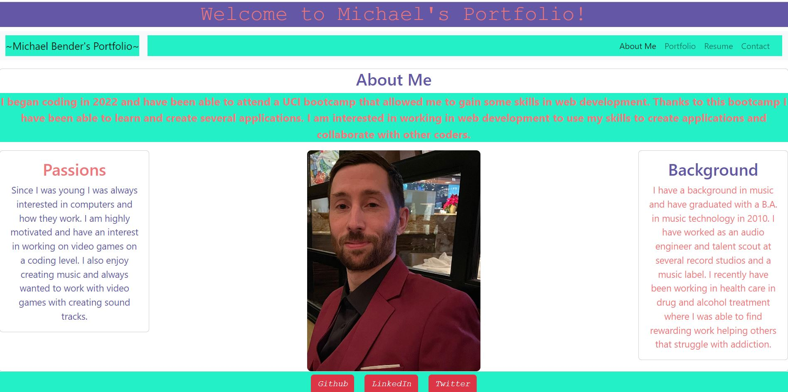
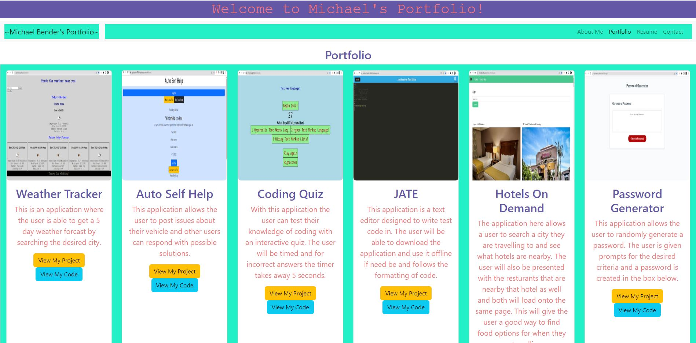
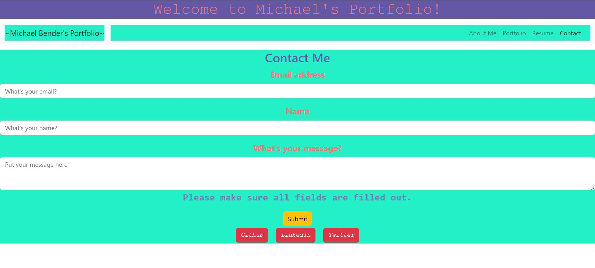

# React Professional Portfolio

## _Table Of Contents_

1. [Description](#description)
2. [Usage](#usage)
3. [Installation](#installation)
4. [License](#license)
5. [Criteria For Assignment](#criteria-for-assignment)
6. [Repo Link](#repository-link)
7. [Deployed Website](#deployed-website)
8. [Screen Shots](#screen-shots)

## Description

For this assignment I was tasked with creating a professional portfolio for myself. Differing from the first assignment, I will be creating this one using concepts with react. This application will allow a user to load the page and gain information about myself. The user will be able to see some projects I have created, a little about me, and able to contact me with any questions. The user will also be able to download my resume and view some of my social media links.

Due to an issue with react-router-dom and github pages, I deployed my application with Heroku.

## Usage

The user will be able to view the page and see information about myself and the projects I've worked on during this course. The user will be able to see pictures of my projects and links to the application and the repo to view the code.

## Installation

You will need to run npm install after cloning the repo to aquire the react packages. This will install the react npms and bootstrap.

## License

MIT

_Website for license_

[MIT License Website](https://mit-license.org/)

## Criteria-for-assignment

GIVEN a single-page application portfolio for a web developer

**WHEN I load the portfolio**
*THEN I am presented with a page containing a header, a section for content, and a footer*

**WHEN I view the header**
*THEN I am presented with the developer's name and navigation with titles corresponding to different sections of the portfolio*

**WHEN I view the navigation titles**
*WHEN I am presented with the titles About Me, Portfolio, Contact, and Resume, and the title corresponding to the current section is highlighted*

**WHEN I click on a navigation title**
*THEN I am presented with the corresponding section below the navigation without the page reloading and that title is highlighted*

**WHEN I load the portfolio the first time**
*THEN the About Me title and section are selected by default* 

**WHEN I am presented with the About Me section**
*THEN I see a recent photo or avatar of the developer and a short bio about them*

**WHEN I am presented with the Portfolio section**
*THEN I see titled images of six of the developer’s applications with links to both the deployed applications and the corresponding GitHub repository*

**WHEN I am presented with the Contact section**
*THEN I see a contact form with fields for a name, an email address, and a message*

**WHEN I move my cursor out of one of the form fields without entering text**
*THEN I receive a notification that this field is required*

**WHEN I enter text into the email address field**
*THEN I receive a notification if I have entered an invalid email address*

**WHEN I am presented with the Resume section**
*THEN I see a link to a downloadable resume and a list of the developer’s proficiencies*

**WHEN I view the footer**
*THEN I am presented with text or icon links to the developer’s GitHub and LinkedIn profiles, and their profile on a third platform (Stack Overflow, Twitter)*

## Repository-Link

[Github](https://github.com/PintoDrop/reactpro)

## Deployed-Website

[Deployed Website](https://michaelportfolio.herokuapp.com/)

## Screen-Shots

